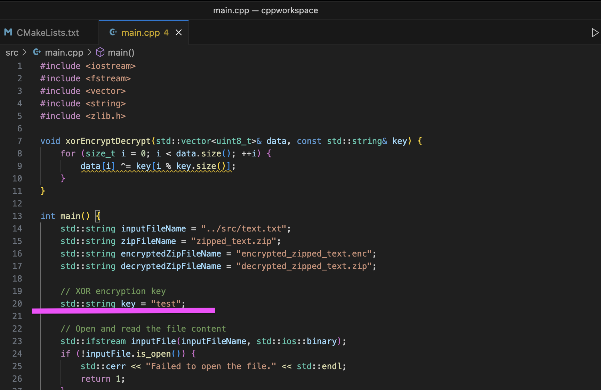
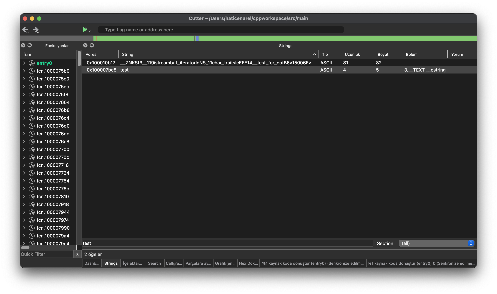
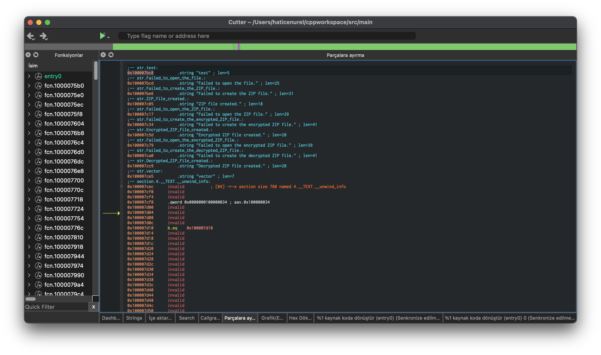

# crackme

# Crackme

This repository encompasses an XOR encryption project alongside a comprehensive decryption guide leveraging Node.js.

## XOR Encryption Project (Located in the Target Folder)

Within the "target" directory, resides an XOR encryption project that showcases the encryption of data through XOR, utilizing a key. Moreover, it demonstrates the decryption of this encrypted data, restoring it to its initial state.

### Extraction of Encryption Key

The encrypted binary file contains the essential XOR key. The process of extracting this key is accomplished through reverse engineering tools or through an analysis of the binary content.

## Decryption Utilizing Node.js (Found in the Process Folder)

Contained within the "process" folder are encrypted files that were encrypted via the XOR encryption project. To decrypt these files, developers can employ the provided Node.js code.

### Prerequisites

This guide necessitates the presence of Node.js on your development environment.

### Decryption Procedure

To decrypt the encrypted files using the Node.js code snippet provided above, adhere to the following sequence:

1. Initiate by duplicating the source code and subsequently reorganizing it. In this process, replace the existing key with the string "test", as opposed to the char 'K'.


2. Employ the cutter tool to search for the specific string "test".


3. Proceed to the "parçalara ayırma" section, pinpointing the occurrence of `str.test`:
   ```
   0x100007bc8  .string "test" ; len=5.
   ```


4. Click on the x button, and navigate to the X-ref for `0x100007bc8`.


5. Select `0x100003568` to navigate to its contents:
   ```
   add x1, x1, 0xbc8 ; 0x100007bc8 ; int64_t arg2 in "parçalara ayırma"
   ```


6. Proceed to the "%1 kaynak koda dönüştür (entry 0) senkronize edilmemiş" section pertaining to `0x100003568`.


7. Locate and observe the line:
   ```
   __ZNSt3__112basic_stringIcNS_11char_traitsIcEENS_9allocatorIcEEEC1B6v15006IDnEEPKc
   ((int64_t)&var_e20h, (int64_t)"test");
   ```


8. Elicit an understanding of where `var_e20h` is utilized within the decompiled code.

9. Recognize the presence of `var_e20h` in two additional instances:
   ```
   __Z17xorEncryptDecryptRNSt3__16vectorIhNS_9allocatorIhEEEERKNS_12basic_stringIcNS_11char_traitsIcEENS1_IcEEEE
   ((int64_t)&var_e68h, (int64_t)&var_e20h);
   ```
   as well as
   ```
   __Z17xorEncryptDecryptRNSt3__16vectorIhNS_9allocatorIhEEEERKNS_12basic_stringIcNS_11char_traitsIcEENS1_IcEEEE
   ((int64_t)&var_e90h, (int64_t)&var_e20h);
   ```


10. Utilize the x button to direct your focus towards `__Z17xorEncryptDecryptRNSt3__16vectorIhNS_9allocatorIhEEEERKNS_12basic_stringIcNS_11char_traitsIcEENS1_IcEEEE`.


11. Initiate a X-Ref exploration for `__Z17xorEncryptDecryptRNSt3__16vectorIhNS_9allocatorIhEEEERKNS_12basic_stringIcNS_11char_traitsIcEENS1_IcEEEE`.

12. Capture the address `0x1000000d0` from:
    ```
    .qword 0x000000010000334c ; section.0.__TEXT.__text ; sym.__Z17xorEncryptDecryptRNSt3__16vectorIhNS_9allocatorIhEEEE ; sym.func.10000334c
    ```

13. Insert the address "0x1000000d0" within the cutter tool for the source code.

14. Identify the presence of:
    ```
    .qword 0x0000000100003338 ; section.0.__TEXT.__text ; sym.__Z17xorEncryptDecryptRNSt3__16vectorIhNS_9allocatorIhEEEEc ; sym.func.100003338
    ```

15. Navigate to the section.0.__TEXT.__text:
    ```
    ;-- func.100003338:
    xorEncryptDecrypt(std::__1::vector<unsigned char, std::__1::allocator<unsigned char> >&, char) (int64_t arg1, int64_t arg2);
    ; arg int64_t arg1 @ x0
    ; arg int64_t arg2 @ x1
    ; var int64_t var_40h @ stack - 0x40
    ; var int64_t var_38h @ stack - 0x38
    ; var int64_t var_30h @ stack - 0x30
    ; var int64_t var_28h @ stack - 0x28
    ; var int64_t var_19h @ stack - 0x19
    ; var int64_t var_18h @ stack - 0x18
    ; var int64_t var_10h @ stack - 0x10
    0x100003338  sub sp, sp, 0x40 ; [00] -r-x section size 17004 named 0.__TEXT.__text in "parçalara ayırma" part.
    ```

16. Employ the x button to unveil the X-Ref for `0x100003338`. Select `0x1000037b4      bl      __Z17xorEncryptDecryptRNSt3__16vectorIhNS_9allocatorIhEEEEc ; sym.__Z17xorEncryptDecryptRNSt3__16vectorIhNS_9allocatorIhEEEEc ;  sym.__Z17xorEncryptDecryptRNSt3__16vectorIhNS_9allocatorIhEEEEc(int64_t arg1, int64_t arg2)`.


17. Transition to the "%1kaynak kodu" section for `0x1000037b4`.

18. Recognize the line:
    ```
    __Z17xorEncryptDecryptRNSt3__16vectorIhNS_9allocatorIhEEEEc((int64_t)&var_e50h, (int64_t)var_e09h);
    ```


19. Ascertain the instances where `var_e09h` is integrated within the "%1 kaynak kodu" segment.


20. Finally, ascertain the char key 'K' by leveraging `var_e09h`.

(Note: For a visual reference, screenshots corresponding to each step can be effectively incorporated.)